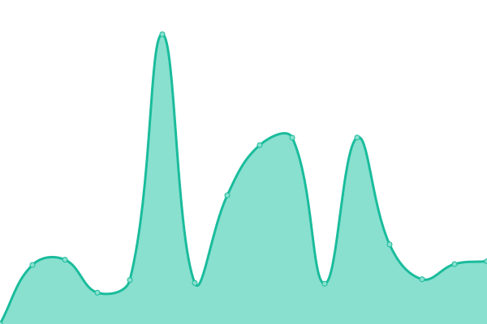
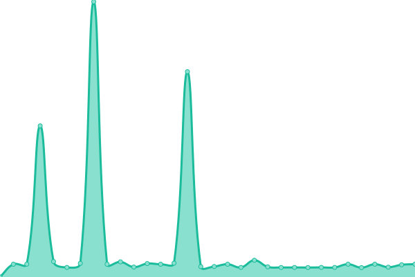

# [📈 Estado Actual](https://radar.la-razon.com): <!--live status--> **🟧 Interrupción parcial**

This repository contains the open-source uptime monitor and status page for [La Razón](www.la-razon.com), powered by [Upptime](https://github.com/upptime/upptime).

With [Upptime](https://upptime.js.org), you can get your own unlimited and free uptime monitor and status page, powered entirely by a GitHub repository. We use [Issues](https://github.com/la-razonbo/radar/issues) as incident reports, [Actions](https://github.com/la-razonbo/radar/actions) as uptime monitors, and [Pages](https://radar.la-razon.com) for the status page.

<!--start: status pages-->
<!-- This summary is generated by Upptime (https://github.com/upptime/upptime) -->
<!-- Do not edit this manually, your changes will be overwritten -->
<!-- prettier-ignore -->
| URL | Status | History | Response Time | Uptime |
| --- | ------ | ------- | ------------- | ------ |
|  [CSBP - PORTAL](https://portal.csbp.com.bo) | ✅ Up | [csbp-portal.yml](https://github.com/la-razonbo/radar/commits/HEAD/history/csbp-portal.yml) | 

 4071ms
     
 | 

<a href="https://radar.la-razon.com/history/csbp-portal">93.08%</a>
    

|  [CSBP - WWW](https://www.csbp.com.bo) | ✅ Up | [csbp-www.yml](https://github.com/la-razonbo/radar/commits/HEAD/history/csbp-www.yml) | 

 2596ms
     
 | 

<a href="https://radar.la-razon.com/history/csbp-www">95.53%</a>
    

|  [CSBP - ASEGURADOS](https://asegurados.csbp.com.bo) | ✅ Up | [csbp-asegurados.yml](https://github.com/la-razonbo/radar/commits/HEAD/history/csbp-asegurados.yml) | 

 1449ms
     
 | 

<a href="https://radar.la-razon.com/history/csbp-asegurados">94.53%</a>
    

|  [CSBP - CITAS](https://citas.csbp.com.bo) | 🆘 Down | [csbp-citas.yml](https://github.com/la-razonbo/radar/commits/HEAD/history/csbp-citas.yml) | 

 912ms
     
 | 

<a href="https://radar.la-razon.com/history/csbp-citas">92.70%</a>
    

<!--end: status pages-->

[**Visit our status website →**](https://radar.la-razon.com)

## 📄 License

- Powered by: [Upptime](https://github.com/upptime/upptime)
- Code: [MIT](./LICENSE) © [La Razón](www.la-razon.com)
- Data in the `./history` directory: [Open Database License](https://opendatacommons.org/licenses/odbl/1-0/)
