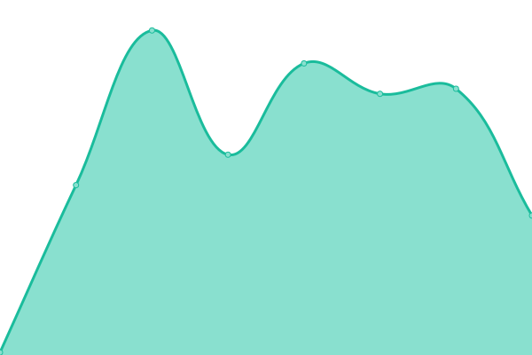
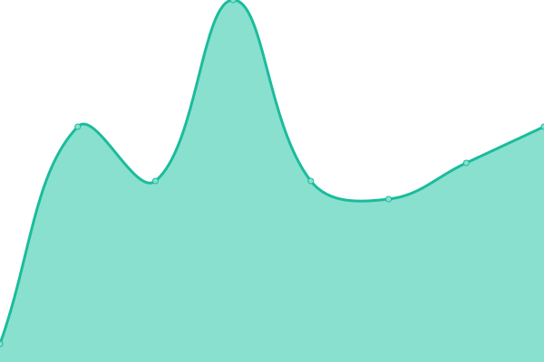
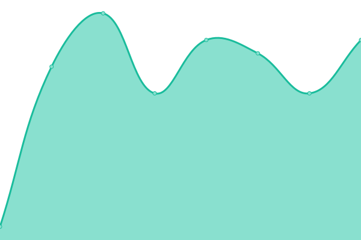
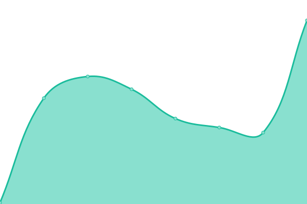

# [📈 Estado Actual](https://radar.la-razon.com): <!--live status--> **🟧 Interrupción parcial**

This repository contains the open-source uptime monitor and status page for [La Razón](www.la-razon.com), powered by [Upptime](https://github.com/upptime/upptime).

With [Upptime](https://upptime.js.org), you can get your own unlimited and free uptime monitor and status page, powered entirely by a GitHub repository. We use [Issues](https://github.com/la-razonbo/radar/issues) as incident reports, [Actions](https://github.com/la-razonbo/radar/actions) as uptime monitors, and [Pages](https://radar.la-razon.com) for the status page.

<!--start: status pages-->
<!-- This summary is generated by Upptime (https://github.com/upptime/upptime) -->
<!-- Do not edit this manually, your changes will be overwritten -->
<!-- prettier-ignore -->
| URL | Status | History | Response Time | Uptime |
| --- | ------ | ------- | ------------- | ------ |
|  [La Razón](https://www.la-razon.com) | 🆘 Down | [la-razon.yml](https://github.com/la-razonbo/radar/commits/HEAD/history/la-razon.yml) | 

 91ms
     
 | 

<a href="https://radar.la-razon.com/history/la-razon">0.00%</a>
    

|  [Login LR](https://www.la-razon.com/login) | 🆘 Down | [login-lr.yml](https://github.com/la-razonbo/radar/commits/HEAD/history/login-lr.yml) | 

 13ms
     
 | 

<a href="https://radar.la-razon.com/history/login-lr">0.00%</a>
    

|  [El Loro de Oro](https://lorodeoro.la-razon.com) | 🆘 Down | [el-loro-de-oro.yml](https://github.com/la-razonbo/radar/commits/HEAD/history/el-loro-de-oro.yml) | 

 92ms
     
 | 

<a href="https://radar.la-razon.com/history/el-loro-de-oro">0.00%</a>
    

|  [El Loro (ADMIN)](https://lorodeoro.la-razon.com/admin) | 🆘 Down | [el-loro-admin.yml](https://github.com/la-razonbo/radar/commits/HEAD/history/el-loro-admin.yml) | 

 12ms
     
 | 

<a href="https://radar.la-razon.com/history/el-loro-admin">0.00%</a>
    

|  [LR Store](https://la-razon.ventas.com.bo) | ✅ Up | [lr-store.yml](https://github.com/la-razonbo/radar/commits/HEAD/history/lr-store.yml) | 

 1842ms
     
 | 

<a href="https://radar.la-razon.com/history/lr-store">100.00%</a>
    

|  [LR DEV-QA](https://dev-qa.la-razon.com) | 🆘 Down | [lr-dev-qa.yml](https://github.com/la-razonbo/radar/commits/HEAD/history/lr-dev-qa.yml) | 

 60ms
     
 | 

<a href="https://radar.la-razon.com/history/lr-dev-qa">0.00%</a>
    

|  [Login DEV-QA](https://dev-qa.la-razon.com/login) | 🆘 Down | [login-dev-qa.yml](https://github.com/la-razonbo/radar/commits/HEAD/history/login-dev-qa.yml) | 

 12ms
     
 | 

<a href="https://radar.la-razon.com/history/login-dev-qa">0.00%</a>
    

|  [PAPER Sisetic (new)](https://ipaper.la-razon.com) | 🆘 Down | [paper-sisetic-new.yml](https://github.com/la-razonbo/radar/commits/HEAD/history/paper-sisetic-new.yml) | 

 77ms
     
 | 

<a href="https://radar.la-razon.com/history/paper-sisetic-new">0.00%</a>
    

<!--end: status pages-->

[**Visit our status website →**](https://radar.la-razon.com)

## 📄 License

- Powered by: [Upptime](https://github.com/upptime/upptime)
- Code: [MIT](./LICENSE) © [La Razón](www.la-razon.com)
- Data in the `./history` directory: [Open Database License](https://opendatacommons.org/licenses/odbl/1-0/)
